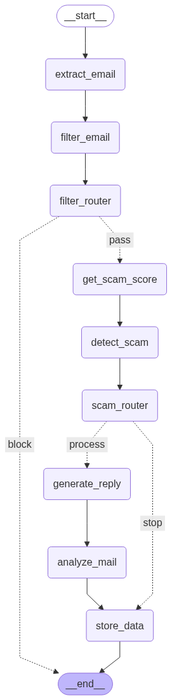

# 📧🧠 MailMind

MailMind is an AI-powered email agent that intelligently processes incoming emails to detect scams or phishing attempts, generate smart replies for legitimate emails, and extract task-related information.  
It integrates with the **Gmail API** for real-time email retrieval, uses **LangGraph** for decision routing, and leverages **LLMs** with built-in security guardrails to ensure safe and reliable email automation.

---

## ✨ Features

- 🚨 **Scam & Phishing Detection**  
  Automatically classifies emails as scam/phishing or legitimate using LLM-based reasoning.

- ✉️ **Intelligent Reply Generation**  
  Generates context-aware replies for legitimate emails.

- 📋 **Task & Action Item Extraction**  
  Identifies tasks, deadlines, and actionable items from emails.

- 🔀 **Decision Routing with LangGraph**  
  Routes emails through different processing paths (scam detection, reply generation, task extraction).

- 🔐 **Security Guardrails**  
  Protects against prompt injection and sensitive data leakage.

- 📬 **Gmail API Integration**  
  Fetches and processes emails in real time.

---
## 🧠 AI Agent Workflow
<p align="center">
  
</p>


---
## 🛠️ Tech Stack

| Component        | Technology Used              |
|------------------|------------------------------|
| 🐍 Programming   | Python                       |
| 🤖 LLMs          | Gemma    |
| 🔗 Orchestration | LangGraph + LangChain        |
| 📬 Email API     | Gmail API                    |

---

## 📂 Project Structure

```text
MailMind/
├── main.py
├── gmail_reader.py
├── mongo_service.py
├── mailgraph.py
├── llm_process.py
├── llm_guardrails.py
├── requirements.txt
├── README.md
├── .env
```

---

## ⚙️ Installation & Setup (Using pip)

1. 📥 Clone the repository:
   ```bash
   git clone https://github.com/Sameer078/MailMind
   cd MailMind
   ```

2. 🧪 Create and activate a virtual environment:
   ```bash
   python -m venv venv
   source venv/bin/activate
   ```
   On Windows:
   ```bash
   venv\Scripts\activate
   ```

3. 📦 Install dependencies:
   ```bash
   pip install -r requirements.txt
   ```

4. 🔑 Set environment variables:
   ```bash
   export GROQ_API_KEY="your_groq_api_key_here"
   export MONGODB_URL="mongodb://localhost:27017"
   export MONGODB_DATABASE="mailmind_db"
   export MONGODB_COLLECTION="mails"
   ```
   On Windows:
   ```bash
   set GROQ_API_KEY=your_groq_api_key_here
   set MONGODB_URL=mongodb://localhost:27017
   set MONGODB_DATABASE=mailmind_db
   set MONGODB_COLLECTION=mails
   ```

---

## ⚡ Installation & Setup (Using uv)

`uv` is a fast Python package and environment manager.

1. 📥 Clone the repository:
   ```bash
   git clone https://github.com/Sameer078/MailMind
   cd MailMind
   ```

2. 📦 Initialize the project:
   ```bash
   uv init .
   ```

3. 🧪 Create a virtual environment:
   ```bash
   uv venv
   ```

4. ▶️ Activate the virtual environment:
   ```bash
   .venv/Scripts/activate
   ```
   On macOS/Linux:
   ```bash
   source .venv/bin/activate
   ```

5. 📦 Install dependencies:
   ```bash
   uv add -r requirements.txt
   ```
6. 🔑 Set environment variables:
   ```bash
   export GROQ_API_KEY="your_groq_api_key_here"
   export MONGODB_URL="mongodb://localhost:27017"
   export MONGODB_DATABASE="mailmind_db"
   export MONGODB_COLLECTION="mails"
   ```
   On Windows:
   ```bash
   set GROQ_API_KEY=your_groq_api_key_here
   set MONGODB_URL=mongodb://localhost:27017
   set MONGODB_DATABASE=mailmind_db
   set MONGODB_COLLECTION=mails
   ```


---

## ▶️ How to Run the Project

🚀 Start the MailMind agent:

```bash
python main.py
```

---

## 🧑‍💻 Usage Example

1. 📬 MailMind fetches new emails from Gmail  
2. 🔍 Emails are classified as scam or legitimate  
3. ✉️ Legitimate emails receive AI-generated replies  
4. 📋 Tasks and action items are extracted  
5. 🚫 Scam or phishing emails are flagged and blocked  

---
